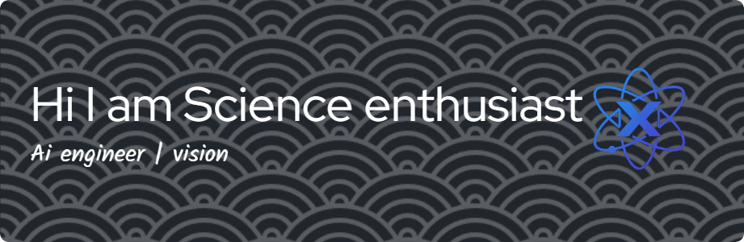

## Hello Cosmos Nafis Here
 
>### i will change universe with GNOSIS

<!--
**Nafisz/Nafisz** is a ✨ _special_ ✨ repository because its `README.md` (this file) appears on your GitHub profile.

Here are some ideas to get you started:

- 🔭 I’m currently working on ...
- 🌱 I’m currently learning ...
- 👯 I’m looking to collaborate on ...
- 🤔 I’m looking for help with ...
- 💬 Ask me about ...
- 📫 How to reach me: ...
- 😄 Pronouns: ...
- ⚡ Fun fact: ...
-->
- 🌱 I’m currently learning on **@Coursera**
- learn about ml and dl with **@DicodingxMicrososft**

>#### comunity
💬 Join my Discord: [discord](https://discord.com/channels/1369984315638939718/1369984316334931992) or @BASICBRINE99

>##### Skils
###### programming leangue

 

###### Unfinished
        

###### IDEs
   

>##### Edu Platform
   

#### Connect with me
   
